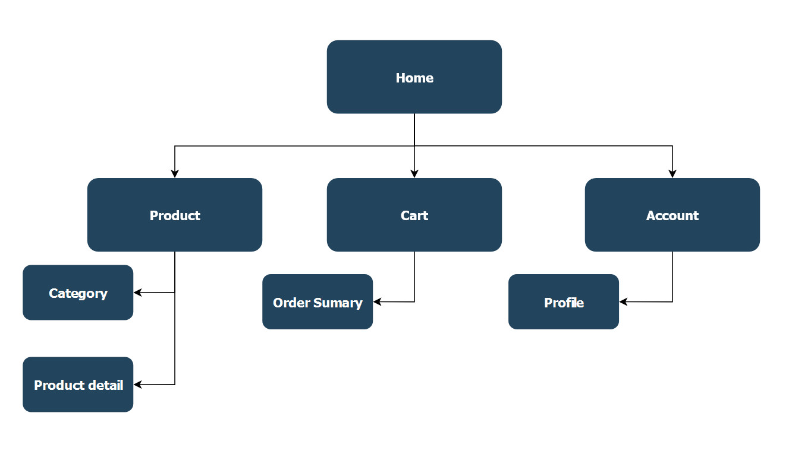
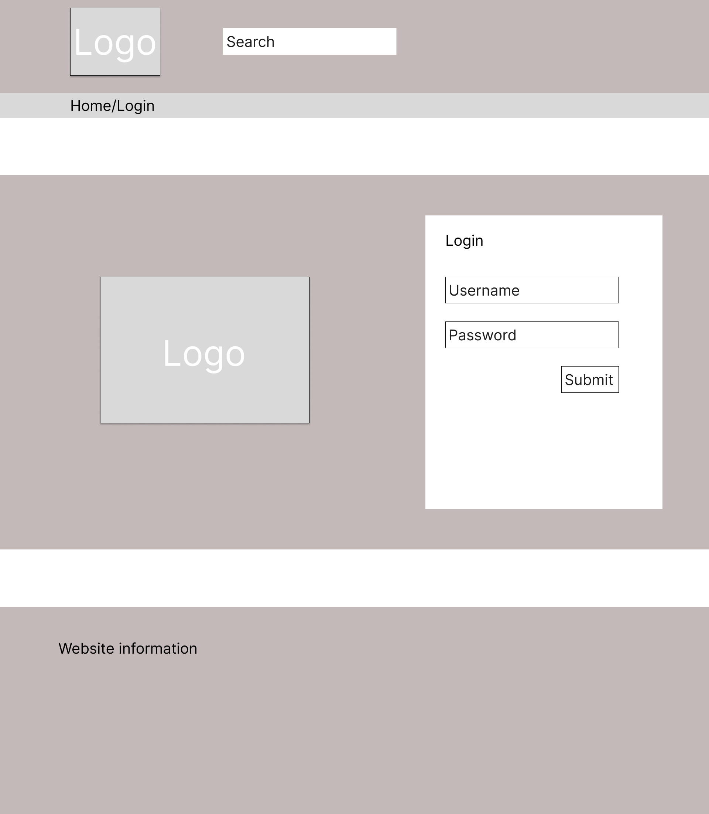
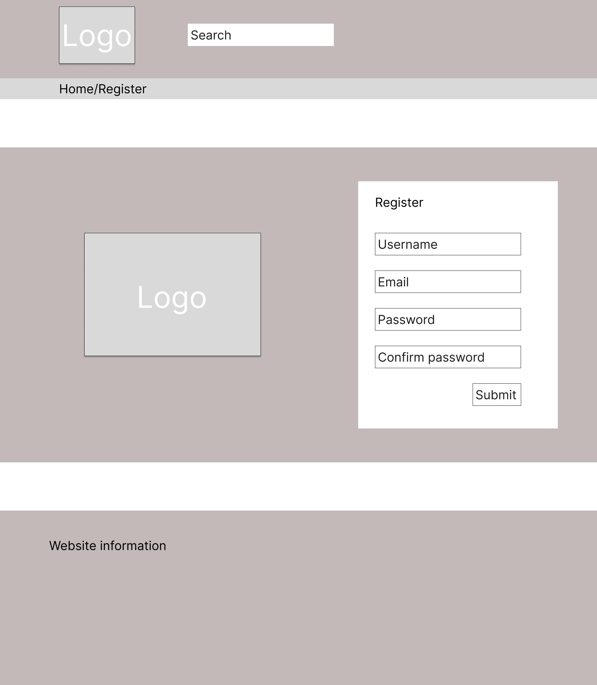
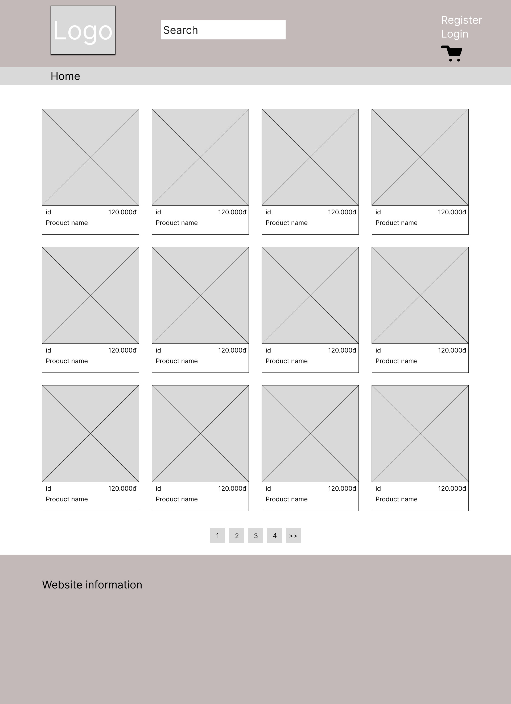
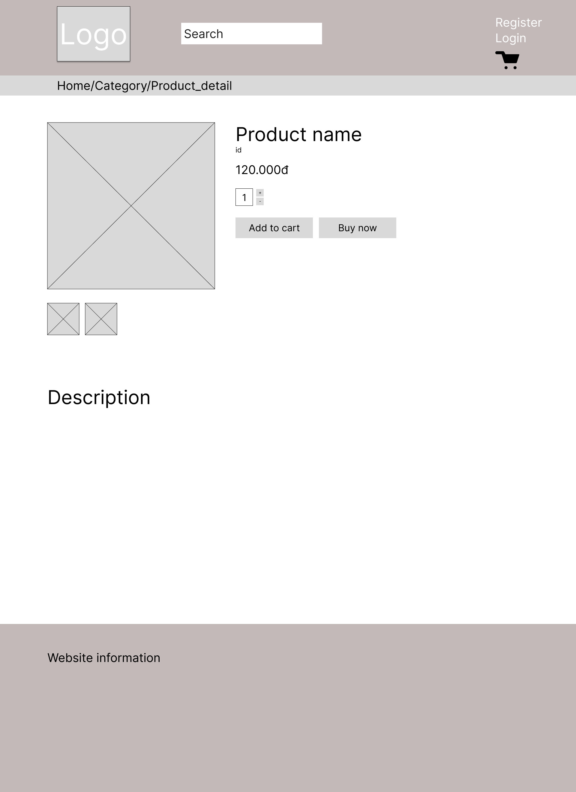
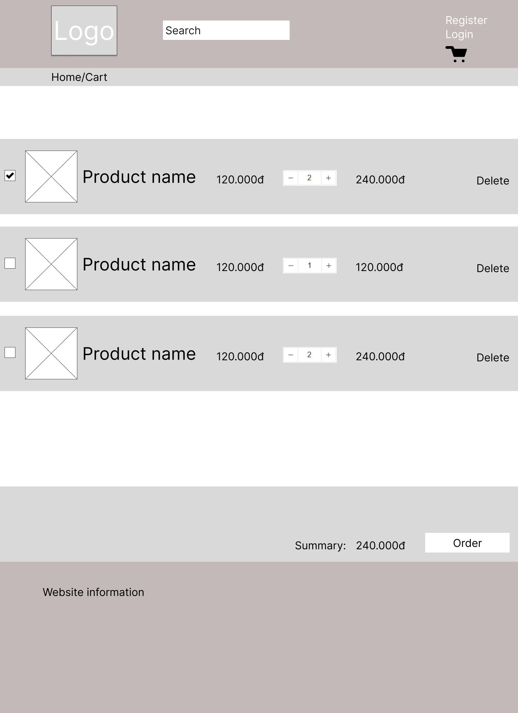
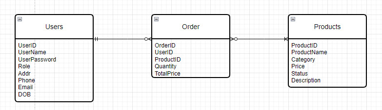

# Fehese

## 1.Introduction

- Project purpose: The vision of Fehese is to provide a convenient and user-friendly platform for book lovers to browse, buy and review books online. Fehese aims to offer a wide range of books from various genres, authors and publishers, as well as personalized recommendations based on the user’s preferences and reading history. The web application also enables users to interact with other readers, share their opinions and feedback, and join online book clubs and events. The web application strives to create a vibrant and engaging community of book enthusiasts who can enjoy reading and learning from books anytime and anywhere.

- Project actors:
  - Admin(ad)
  - Customer(cus)

- Functions:

| Actor | Functions | Description |
| --- | --- | --- |
| ad, cus | login | allows user to access their personal account on Fehese database |
| ad, cus | sort category | allows users to organize the books displayed on the web application according to different criteria |
| ad, cus | search book | allows users to find specific books or books related to a certain keyword on the web application |
| ad, cus | customize profile | enables users to edit their profile information, such as their name, email, address, phone number, password, and more |
| ad | add books | allows the web application’s administrators to upload new books to the web application’s database |
| ad | delete books | allows the web application’s administrators to remove books from the web application’s database | 
| ad | manage orders | allows admin to process, track, view order's details and update order's status such as confirmed, delivered |
| cus | add to cart | allows users to select and save the books they want to buy on the web application, it also allows users to view, edit, or remove the books in their shopping cart |

## 2.GUI/SITEMAPS
## - SITEMAPS

## - GUI/LOGIN

## - GUI/REGISTER

## - GUI/HOMEPAGE

## - GUI/DETAIL

## - GUI/CART

## 3.ERD

